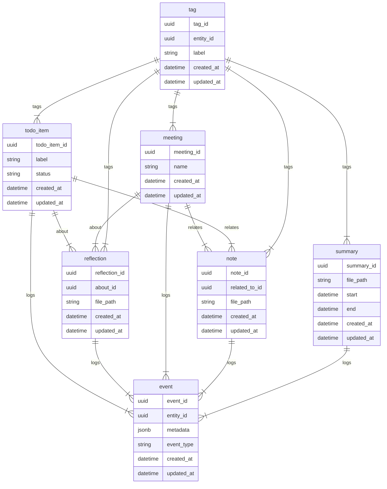

## Features

- TUI -- runs in the terminal, as all things should
- TODO list, stored in a Turso DB instance
- event log, stored in a Turso DB instance
- general notes to self
- Reflections -- journal entries written by the user which can be attached to _any_ entity such as TODO item, meeting or note.
- notes and reflections are stored in markdown files -- linked to from Turso DB rows
- item tagging
- CLI interface for easy AI access

## DB Schema

We should distinguish here between 3 "layers" of entities that are meaningful to this design. 
We have a "base entity" layer here of `todo_item` and `meeting`. These represent the most "real world"
things that the user is doing day-to-day and wants to keep track of.
We then have the "writing layer" consisting of `note` and `reflection`. Notes are distinct from 
reflections. We can think of notes as hard facts that the user wants to remember about the thing
that the note is related to. Reflections on the other hand are synthesized thoughts that the user
wants to keep about a particular entity. The user is more likely to want to refer back to notes, but
the reflections are helpful for them while they are writing them, and they can be helpful for
summarizing later.
Then there is the "metadata" layer. This is where `event`, `tag` and `summary` entities come in.
The `event` table is an _exhaustive_ event log of everything the user did including creation and 
updating of any entity. It contains a `metadata` field to store historically relevant data such as
`from` and `to` of a todo_item status update.
`tag` (the only table not tracked by `event`) is for tracking tags that a user can place on any entity.
Tags are useful for filtering by a specific subject, or producing a topic-specific summary.
`summary` is a broad summary of all data related to all events of a given time period.
Summaries can also be summaries of summaries, but as far as the database is concerned a summary is 
only linked to a set of events.

